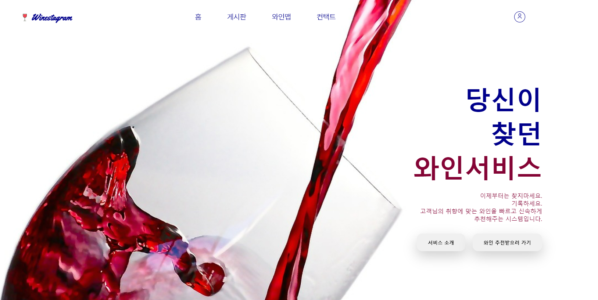
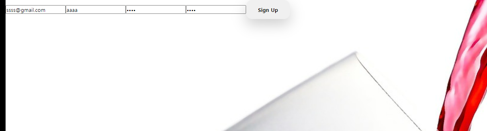
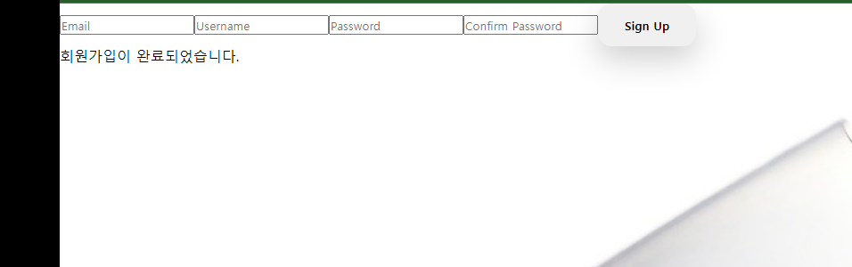
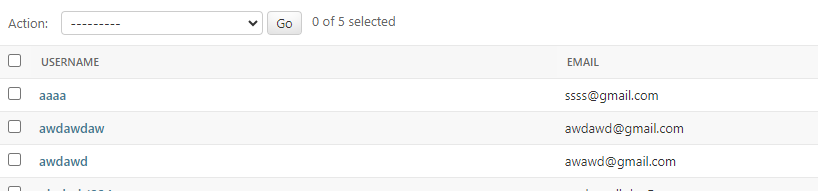

# djang-vue 혼합 프로젝트

## dir 아키텍처

> myproject--- 
> backend--- 
> backend-- 
> accounts-- 
>
> frontend--- 
> assets-- 
> img- 
> scss- 
>
> components-- 
> router-- 
> views-- 

---

backend

- 기본적으로 데이터베이스화 시킬 수 있는 부분들 회원가입,로그인,게시물 등은 admin을 통해 관리 / 배포 예정

frontend

- 앞에서 보여지는 것들 click event~ 및 event 핸들러 구현예정
- SPA 방식으로 넘겨짐이 부드러운 페이지를 목표로 구현 예정

---

1차 구현

- 캡션 : rotuer를 통해 페이지를 5개로 구분 (홈 게시판 와인맵 컨택트 회원가입 )
- 추가로 도입 예정

- 우측 상단에 보면 조그맣게 있다 ... 원래는 미리 꾸며놨다가 csrf 때문에 6시간동안 피똥싸고 초기화를 서너번 한 뒤에 만든거라 css는 나중에 보강하기로 했다

결과창도 alert나 아니면 모달창을 따로 만들 생각이다

- 보면 나와있다.

---

1차 후담 : 솔직히 정말 힘들었다; axios 누가 쉽다고 했는지 만나면 아이스크림 얼굴에 던져 주고 싶다 챗 gpt 없었으면 진짜 잠 못잤다

추가 업로드 예정
ㅁㄴㅇㅁㄴㅇㅁㄴㅇ
